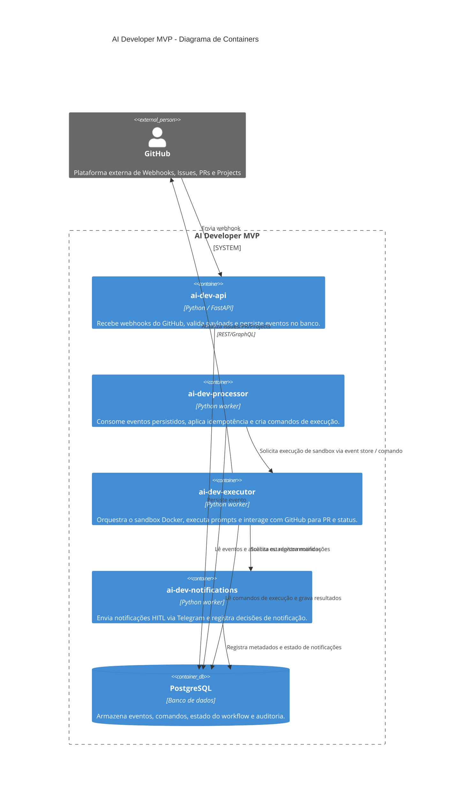

# Espinha de Arquitetura — AI Developer

## Paradigma de Design

Arquitetura enxuta orientada a eventos, com um fluxo canônico de eventos persistidos.
A solução separa:
- uma API leve de Webhook que recebe e persiste eventos externos do GitHub,
- um consumidor Python que consome eventos persistidos e dispara os fluxos de execução baseados em prompts,
- um agente de execução que controla a integração com GitHub, a orquestração do sandbox e as interações de revisão.

Esse paradigma mantém a implementação alinhada ao fazer do event store a fonte única de verdade do estado do workflow e ao isolar efeitos colaterais externos em limites de componente explícitos. 

## Invariantes e Regras

### AD-1 — Persistir todo evento de webhook antes de executar
- **Binds:** ingestão de webhook, event store, consumidor de execução
- **Prevents:** perda ou não rastreamento de payloads de webhook e acoplamento direto entre webhook e execução
- **Rule:** todos os payloads de webhook externos devem ser validados e persistidos atomica-mente antes de qualquer execução ou transição de workflow.

### AD-2 — Processamento de eventos persistidos dirigido por consumidor
- **Binds:** consumidor de eventos, despachante de prompts, estado do workflow de execução
- **Prevents:** execução paralela não controlada e ramificação de workflow não auditável
- **Rule:** um único consumidor deve reivindicar cada evento, registrar transições de estado e só então despachar o fluxo de prompt/execução correspondente.

### AD-3 — Controle de idempotência no consumo de eventos
- **Binds:** event store, processamento do consumidor, estado de workflow
- **Prevents:** reprocessamento duplicado do mesmo evento e efeitos colaterais repetidos
- **Rule:** o sistema deve identificar eventos únicos por `event_id` e/ou hash de payload e aplicar processamento idempotente, garantindo que cada evento persistido gere no máximo uma execução de ação por estado.

### AD-4 — Integração com GitHub Projects / Issues / PR é propriedade do agente de execução
- **Binds:** integração com API do GitHub, criação de PR, sincronização de cards, atualizações de issues
- **Prevents:** mutações GitHub dispersas entre serviços e estado de workflow inconsistente
- **Rule:** apenas o componente executor realiza efeitos colaterais no GitHub; outros serviços leem/escrevem intenções de workflow através do event store.

### AD-5 — Decisões de notificação derivam do estado do evento e são registradas centralmente
- **Binds:** metadados de notificação, estado de evento, ações HITL
- **Prevents:** múltiplos caminhos de notificação descoordenados e alertas humanos inconsistentes
- **Rule:** gatilhos de notificação devem ser armazenados na tabela de eventos ou em um fluxo de auditoria associado; o executor ou um consumidor dedicado pode enviar a mensagem.

### AD-6 — Cada execução é realizada em um sandbox de container efêmero
- **Binds:** agente de execução, controlador de container, pipeline de validação local
- **Prevents:** vazamento de estado do host, execuções não reproduzíveis e deriva de ambiente
- **Rule:** toda execução de código deve ocorrer em um sandbox Docker novo, com checkout isolado, execução de testes/linters e teardown ao final.

### AD-7 — Retentativas de correção de CI são limitadas e escaladas para revisão humana
- **Binds:** tratamento de falha de CI, política de retry, fluxo de escalonamento
- **Prevents:** loops infinitos de correção e reescritas automáticas inseguras
- **Rule:** a correção de falha de CI deve ser tentada no máximo 3 vezes antes que o evento seja marcado para revisão humana e o workflow pause.

## Convenções de Consistência

| Preocupação | Convenção |
| --- | --- |
| Nomenclatura (entidades, arquivos, interfaces, eventos) | `event_*` para eventos persistidos; `workflow_*` para estado de processamento; `GitHub*` para helpers de integração |
| Dados e formatos (ids, datas, formatos de erro, envelopes) | envelopes JSON; timestamps ISO 8601; campos `id`, `type`, `status`, `payload`, `created_at`, `updated_at` |
| Estado e cross-cutting (mutação, erros, logs, config, auth) | transições de estado persistidas por evento; logs estruturados com `event_id` / `workflow_id`; config por variáveis de ambiente; auth via tokens de serviço com escopo |

## Stack

| Nome | Versão |
| --- | --- |
| Python | 3.12 |
| FastAPI | 0.111 |
| PostgreSQL | 16 |
| Docker | 24 |
| GitHub REST/GraphQL API | v3 / GraphQL |
| Telegram Bot API | versão estável atual |

## Semente Estrutural

```text
{project-root}/
  api/                # receptor de webhook, validação de evento, persistência de evento
  processor/          # consumidor de eventos, claim/dispatch do workflow, política de retry
  executor/           # orquestração de sandbox, executor de prompts, integração com GitHub
  persistence/        # esquema de evento, abstrações de repositório, logs de auditoria, migrações
  notifications/      # canais Telegram/HITL, templates de notificação, lógica de entrega
  infra/              # Dockerfiles, manifests compose, configuração de implantação e runtime
  tests/              # testes de integração e contrato para workflow e execução lógica
  docs/               # documentação de arquitetura, operação e implantação
```

## Diagrama de Containers



## Módulos implantáveis como imagem Docker

Os componentes principais são entregues como imagens Docker independentes que podem ser orquestradas em um ambiente local, de CI ou em um cluster leve.

- `ai-dev-api`: serviço HTTP que expõe o endpoint de webhook, valida e persiste eventos de entrada.
- `ai-dev-processor`: serviço de consumidor de eventos que lê a fila/ tabela de eventos, reivindica eventos, aplica idempotência e dispara fluxos de execução.
- `ai-dev-executor`: serviço responsável pela orquestração do sandbox Docker, execução dos prompts / engine LLM e integração com GitHub para criar PRs e atualizar cards/issues.
- `ai-dev-notifications`: serviço de entrega de notificações HITL, responsável por enviar alertas via Telegram e registrar decisões de notificação no event store.
- `ai-dev-migrations`: imagem de utilitário para aplicar migrações de banco de dados e tarefas de manutenção de persistência.

Cada imagem inclui:
- configuração via variáveis de ambiente,
- contêiner leve baseado em Python + dependências necessárias,
- healthcheck básico,
- logging estruturado para `stdout`/`stderr`.

As imagens podem ser orquestradas com `docker-compose` ou uma plataforma de container mais leve, mantendo o event store (`PostgreSQL`) como serviço externo compartilhado.
## Mapa de Capacidade → Arquitetura

| Capacidade / Área | Vive em | Governado por |
| --- | --- | --- |
| Ingestão e persistência de webhook | `api/` + `persistence/` | AD-1 |
| Orquestração de execução orientada a eventos | `processor/` | AD-2, AD-7 |
| Integração com GitHub Projects / Issue / PR | `executor/` | AD-4 |
| Notificação HITL e escalonamento | `notifications/` | AD-5 |
| Execução em sandbox e validação local | `executor/` | AD-5 |

## Adiado

- Esquema detalhado de campos de cards do GitHub Projects e metadados de PR.
- Fluxo exato de engenharia de prompts e orquestração de LLM.
- Ambiente de implantação além do Docker local/CI (Kubernetes, nuvem, infra).
- Seleção de imagem de build para Java/Flutter e configuração de container específica para cada runtime.

